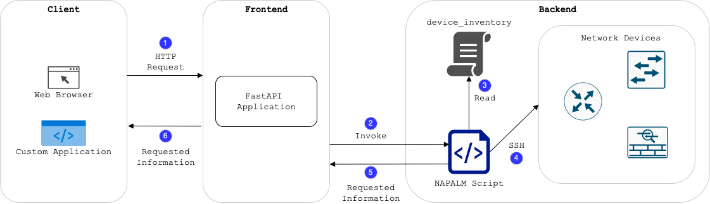
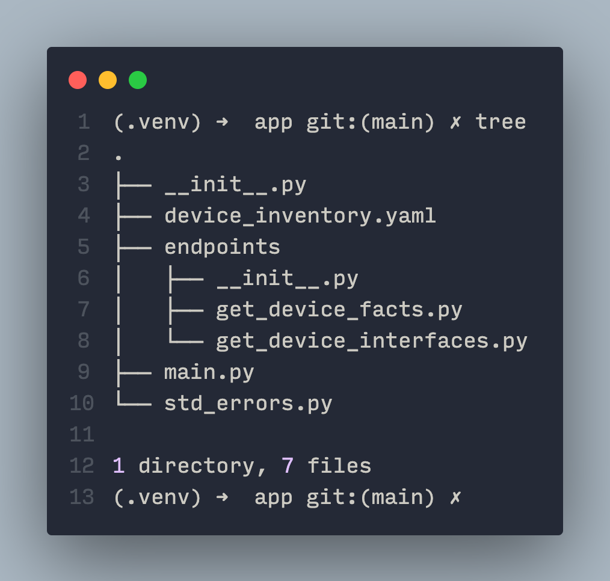
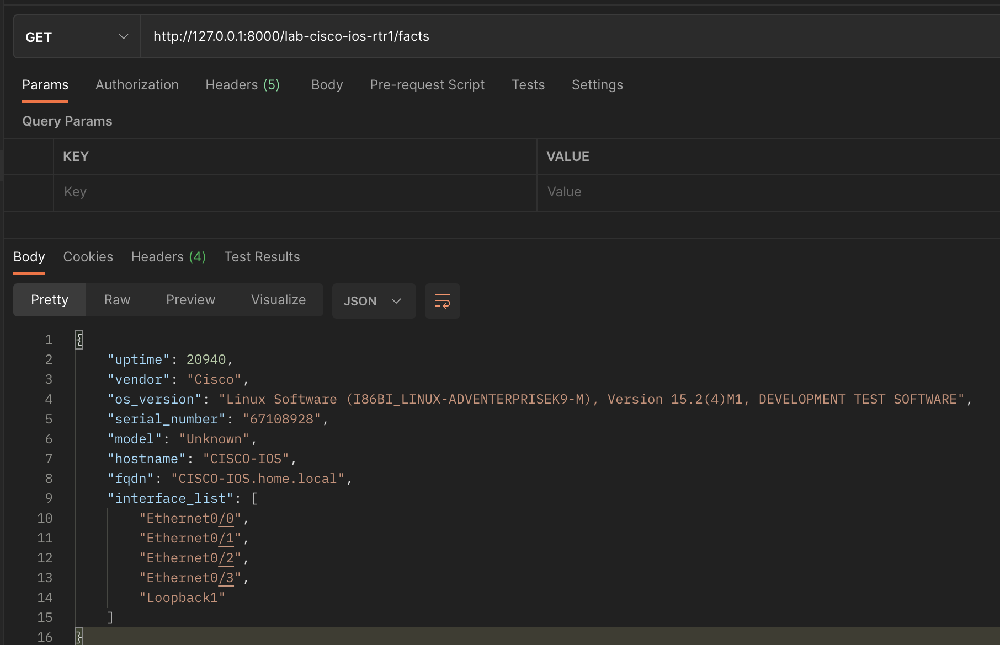
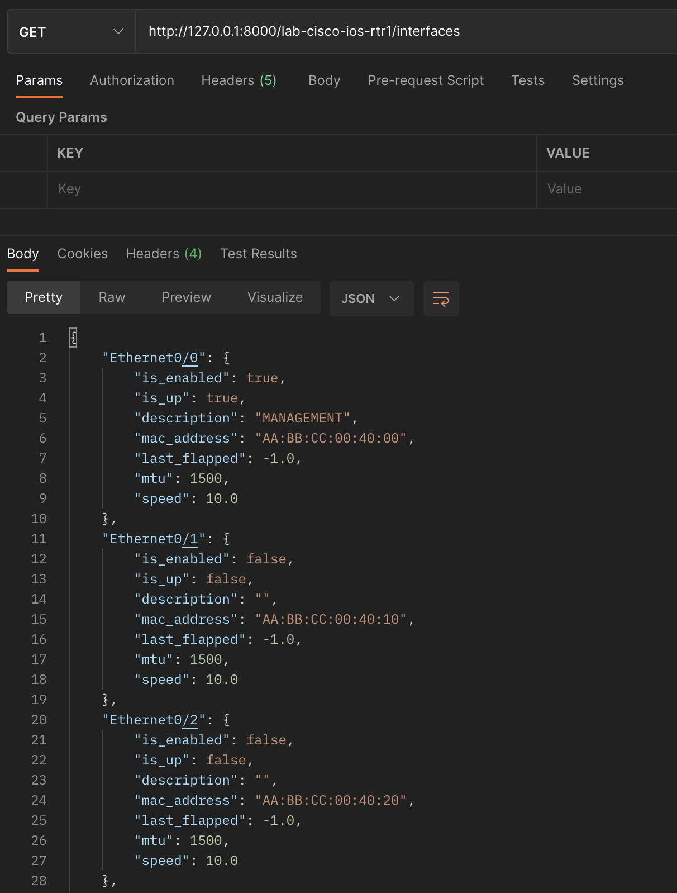
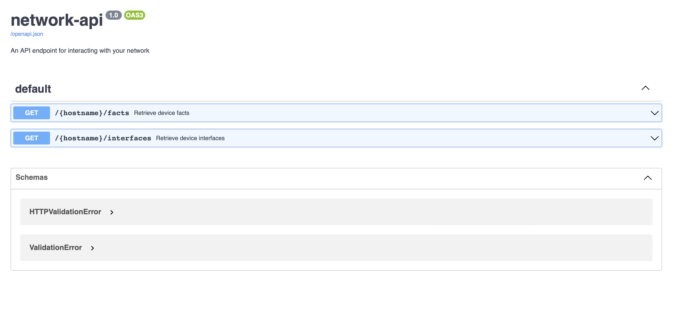

# Introduction

network-api is a tool that can be used to interact with your network using REST API calls.
It can be used to expose your network to developers who are more familiar with the REST API
without having to understand the underlying protocol and complexities of interacting with the network programmatically.

# Technology Stack

The tool uses the following technology stack to provide a simple API interface to interact with the network.

- **FastAPI** as a web framework for building APIs.
- **NAPALM** to interact with the actual network devices.

# Application Architecture

The application architecture can be illustrated in the below diagram.



The application flow can be characterised as below:

1. The clients interact with the network-api tool using HTTP GET requests. The HTTP GET request is served by the FastAPI application.
2. The FastAPI application invoked the appropriate NAPALM method to interact with the network devices.
3. The NAPALM function gets the details of the network device like IP address, username and password from the local inventory file.
4. The NAPALM function uses ssh as the transport protocol to connect to the network device and execute its getter.
5. The NAPALM function returns the output of the getter to the FastAPI application.
6. The FastAPI application returns the output to the client.

# Folder Structure and Files

The below screenshot show the folder structure and files in the application.



The files are as follows:

- **main.py** - The main file that contains the FastAPI application.
- **std_errors.py** - This file that contains the standard error messages that are used by the application.
- **device_inventory.yaml** - This file contains the details of the devices that are part of the network and how to connect to them.
- **endpoints/get_device_facts.py** - This file contains the code for the GET {hostname}/facts endpoint. It also contains the
  NAPALM code to fetch the device facts.
- **endpoints/get_device_interfaces.py** - This file contains the code for the GET /{hostname}/interfaces endpoint. It also contains the
  NAPALM code to fetch the device interfaces.

# Installation

The application can be installed using the following two methods.

If using poetry,

```
poetry install
```

If using venv and pip,

```
python -m venv .venv
pip install -r requirements.txt
```

# Starting the Application

The application can be started by executing the following command in the virtual
environment created during the installation process.

```
uvicorn app.main:app --reload
```

# Interacting with the Application

You can interact with the application using your choice of a web-browser or an API platform like Postman or simple curl commands.

For the sake of representation, below are screenshots of the GET /facts and GET /interfaces endpoints using Postman.

### device_facts



### device_interfaces



# API Documentation

FastAPI automatically generates interactive API documentation. The generated documentation follows the [Swagger 2.0](https://swagger.io/specification/) specification.

The API documentation can be viewed by accessing the following URL in your web browser.

```
http://localhost:8000/docs
```

A screenshot of the API documentation is shown below:



# Improvements

The application is currently not optimized and it is a work in progress.
Some of the improvements to consider are:

- Authentication: Implement an authentication mechanism to restrict access to the application.
- Error handling: Implement better error handling for the application.
- Inventory Management: Implement a better way to manage the inventory of network devices such as Nornir or extract from a SOT such as NetBox/Nautobot.
